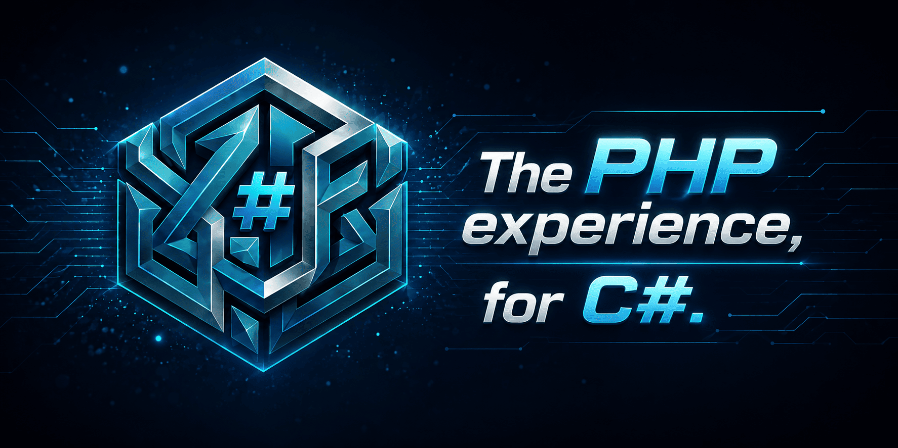

{{BADGES}}

## About

This is a modular .NET framework inspired by the PHP ecosystem and, in particular, by Laravel.

The framework is designed to be used at different levels of abstraction. Its components can be used independently as
standalone packages, combined into modular meta-packages, or consumed as a complete full-featured framework.

The main goal is not to reinvent the .NET ecosystem or squeeze out every last nanosecond of performance. Instead, the
framework focuses on solving routine development tasks and providing practical abstractions that allow developers to
focus on business logic rather than repeatedly writing and copying the same boilerplate code from project to project.

The framework follows a simple principle:

> Don't reinvent the wheel — extend it.

Where .NET already provides a solid and well-established solution, the framework builds on top of it rather than
replacing it with yet another custom implementation.

For example, the validation system is based on the standard .NET `DataAnnotations` infrastructure. Instead of
introducing a completely separate validation engine, the framework extends the existing system with additional
validation rules and capabilities.

The same philosophy applies throughout the framework: reuse what the .NET ecosystem already does well, fill the gaps
around it, and provide convenient abstractions for common application-development scenarios.

The result is a framework that aims to bring some of the developer experience and conventions familiar from Laravel into
the .NET ecosystem — while remaining a natural extension of the platform rather than an attempt to replace it.

## Modules

{{MODULES}}

## Coverage

{{COVERAGE_SUMMARY}}